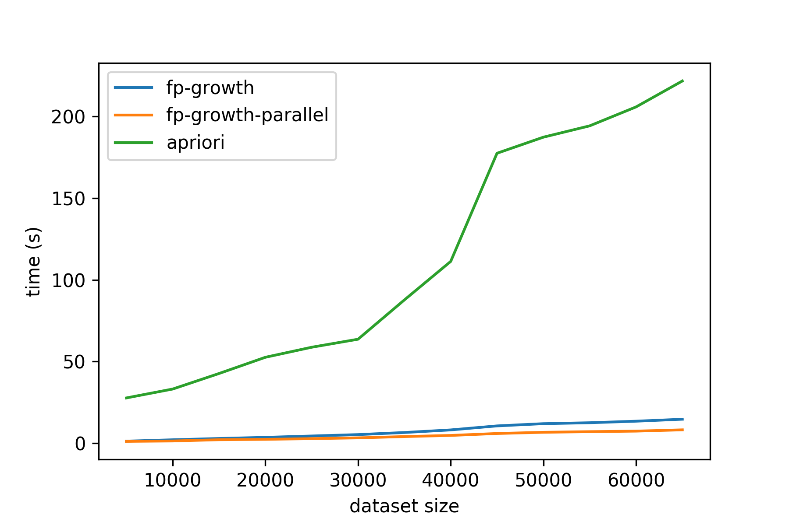

# FP-Growth-Algorithm
A **verified** python implementation of FP growth algorithm for frequent pattern mining.

The implementation correctness has been verified with the [Apriori algorithm in mlxtend](http://rasbt.github.io/mlxtend/user_guide/frequent_patterns/apriori/).



## Features
- Unit test, verify found patterns with Apriori algorithm
- Support mining the patterns in parallel

## Example

```python
from fp_growth import fp_growth

"""FP growth algorithm for frequent patterns mining
Arguments:
    trans: a list of transactions, each transaction is a list of items
    min_support (float): minimum support, default: 0.1
    use_log: logging, default: False
    n_jobs (int): when n_jobs > 1, mining the frequent patterns in paralle. default: 1

Return:
    list of [pattern, frequency] tuples, pattern is an items list
"""

dataset = [[1, 2, 3, 4], [1, 2, 3], [1, 3], [1], [4]]
fps = fp_growth(dataset, min_support=0.6, use_log=False, n_jobs=1)
print(fps)
```
Output:
```python
[([1], 4), 
 ([3], 3), 
 ([1, 3], 3)]
```

## Notes
The performance of mining patterns in parallel heavily depends on the number of items and *min_support*.
